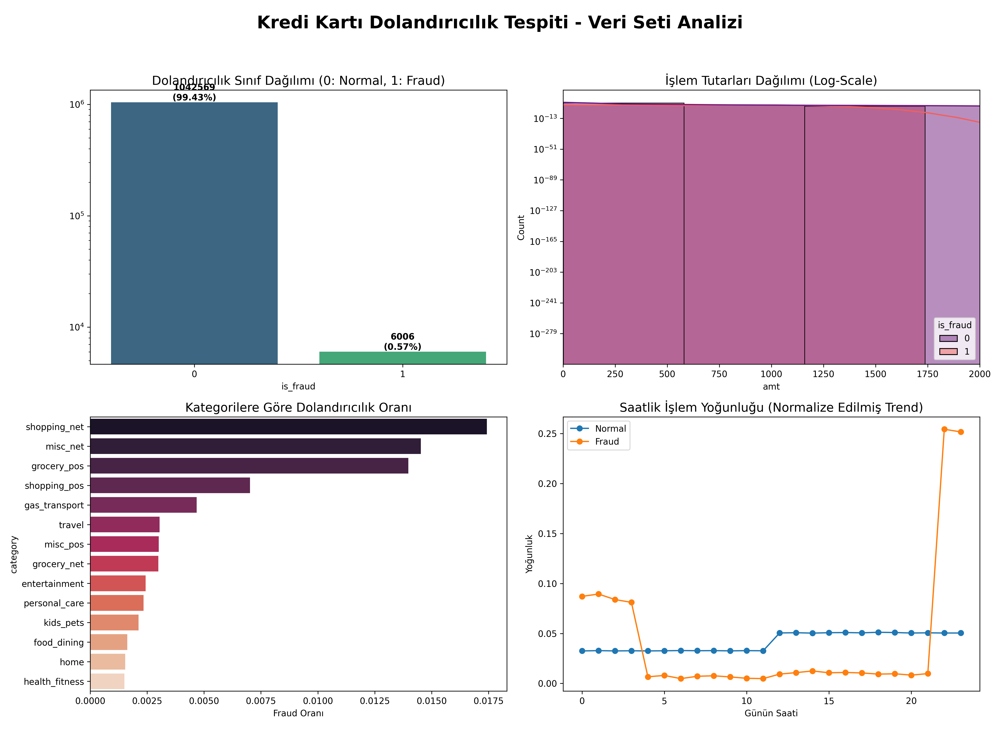
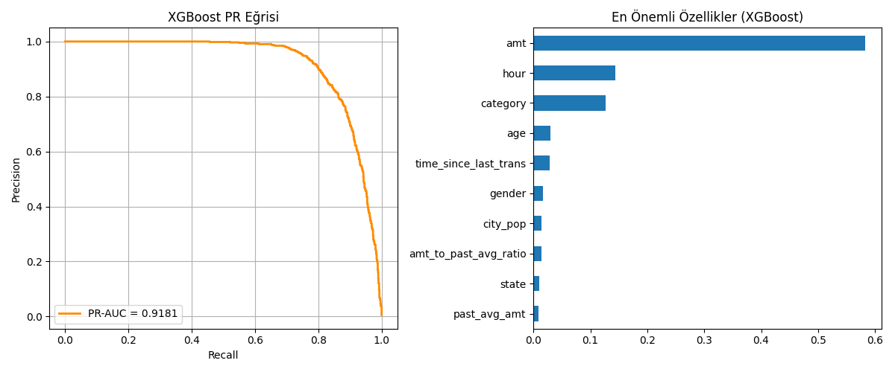
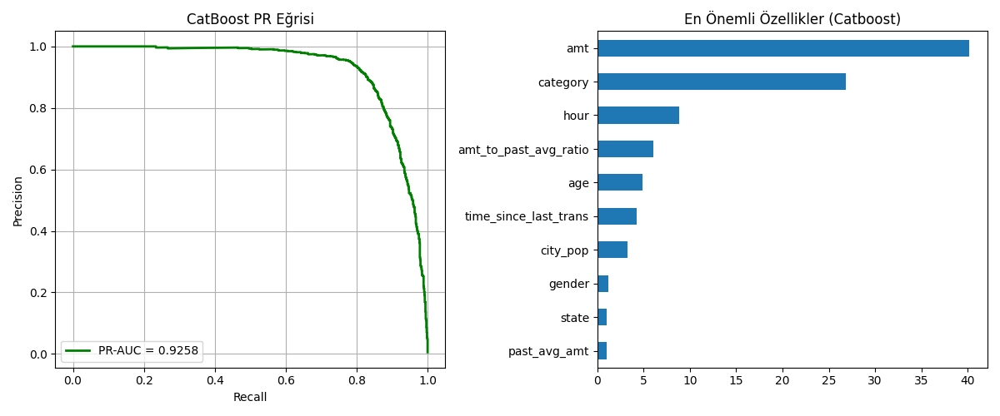
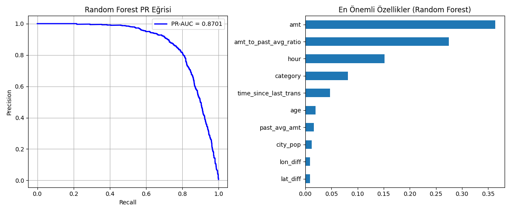
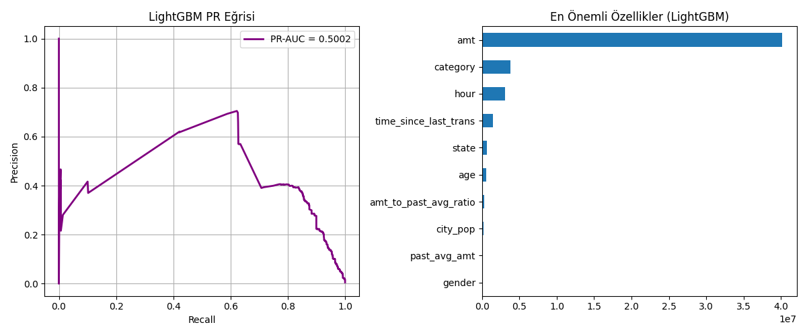

# Kredi Kartı Dolandırıcılık Tespiti ML Projesi

Bu projede, 1 milyonun üzerinde işlem verisi içeren bir veri seti üzerinde, veri sızıntısız ve yüksek performanslı dolandırıcılık tespit modelleri geliştirmeyi amaçladım. Proje kapsamında LightGBM, XGBoost, CatBoost ve Random Forest modellerini başarı metrikleri üzerinden kıyasladım.

## Veri Seti Analizi

Bu projede kullanılan veri seti, Hugging Face üzerindeki [dazzle-nu/CIS435-CreditCardFraudDetection](https://huggingface.co/datasets/dazzle-nu/CIS435-CreditCardFraudDetection) kaynağından alınmıştır. Toplamda **1,048,575 işlem** içeren bu veri seti, gerçek dünya harcama kalıplarını simüle eden kapsamlı bir yapıya sahiptir. Modellerin gerçek hayat koşullarında test edilmesi için bu veri hacmi kullanılmıştır.

### Veri Setinin Dağılımı ve Zorluklar
Dolandırıcılık tespiti projelerinin en büyük karakteristiği olan **Sınıf Dengesizliği**, bu veri setinde de belirgindir. İşlemlerin sadece yaklaşık **%0.58**'i dolandırıcılık olarak etiketlenmiştir. Bu durum, modelin "her şeye normal" diyerek yanıltıcı bir %99.4 accuracy almasını engellemek için PR-AUC gibi daha dürüst metriklerin kullanılmasını zorunlu kılmıştır.

### Temel Veri Dağılımı
Aşağıdaki görselde veri setinin sınıf dağılımı, işlem miktarları ve zaman bazlı yoğunlukları görülmektedir:



### Sütun Açıklamaları
*   **amt:** İşlem tutarı (ABD Doları cinsinden). Dolandırıcılık vakaları genellikle normal işlemlerden farklı tutar dağılımları gösterir.
*   **category:** Alışveriş kategorisi (Eğlence, market, seyahat vb.).
*   **merchant:** İşlemin gerçekleştiği satıcı/mağaza bilgisi.
*   **lat / long:** Müşterinin coğrafi konumu.
*   **merch_lat / merch_long:** Satıcının coğrafi konumu.
*   **unix_time:** İşlemin gerçekleştiği zaman damgası (Zaman serisi özellikleri için ana kaynak).

## Sızıntısız (Leakage-Free) Pipeline

Dolandırıcılık tespiti projelerinde en büyük risk olan **Data Leakage (Veri Sızıntısı)** sorununu gidermek için bu projenin V4 aşamasında tüm mimari yenilenmiştir. 

### Temel Prensipler:
*   **Expanding Mean:** Bir işlemin "ortalama harcama" özelliği hesaplanırken, sadece o işlemden önceki veriler (`cumsum().shift(1)`) kullanılmıştır. Modelin geleceği görmesi fiziksel olarak engellenmiştir.
*   **Zaman Bazlı Split:** Veriler rastgele değil, kronolojik olarak %80 eğitim ve %20 test olarak bölünmüştür.
*   **Davranışsal Özellikler:** İşlem tutarının geçmişe oranı, iki işlem arası geçen süre ve zaman bazlı (saat, gün) özellikler sızıntısız şekilde üretilmiştir.

## Model Karşılaştırma Sonuçları

Aşağıdaki metrikler, modellerin 2000 iterasyon sonucu elde edilen performans metrikleridir:

| Model | PR-AUC | Precision | Recall | F1-Skor |
| :--- | :---: | :---: | :---: | :---: |
| **CatBoost** | **0.9258** | 0.76 | **0.89** | 0.82 |
| **XGBoost** | **0.9181** | **0.89** | 0.81 | **0.85** |
| **Random Forest** | 0.8701 | 0.85 | 0.77 | 0.81 |
| **LightGBM** | 0.5002 | 0.40 | 0.82 | 0.53 |

> [!TIP]
> **Sonuç:** CatBoost yakalama gücü (Recall) açısından en başarılı modelken, XGBoost yanlış alarm sayısını (Precision) minimize etme konusunda en dengeli performansı sergilemiştir.

## Görsel Analizler

Modellerin Precision-Recall eğrileri ve özellik önem düzeyleri:

### 1. XGBoost Performansı


### 2. CatBoost Performansı


### 3. Random Forest Performansı


### 4. LightGBM Performansı


## Nasıl Çalıştırılır?

Projeyi git clone yaptıktan sonra her modeli ayrı scriptler üzerinden eğitebilirsiniz:

```powershell
# Bağımlılıkları yükleyin
pip install pandas numpy xgboost lightgbm catboost scikit-learn matplotlib joblib

# Modelleri eğitin
python train_xgboost.py
python train_catboost.py
python train_lightgbm.py
python train_random_forest.py
```

## Dosya Yapısı
*   `data/`: `fraudTrain.csv` (Veri seti)
*   `plots/`: Modellerin PR Curve ve Feature Importance grafikleri.
*   `models/`: Eğitilmiş dürüst model dosyaları (`.pkl`).
*   `train_*.py`: Her model için optimize edilmiş eğitim scriptleri.

---
**Muhammet Emin Balmuk**
